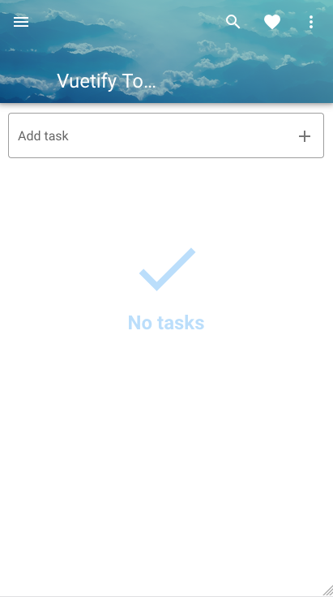

# Vuetify Todo
This project is based on ["Make Apps with Danny" Vuetify demonstration](https://www.youtube.com/watch?v=CjXgoYo86yY).

## Differences in this Branch

The original demonstration finishes with several challenges that are addressed in the author's course. I took it as a personal challenge and tried to implement some of them.

This branch features the first challenge: to add a central component that shows there is no task.



Firstly, I have to check whether there are tasks in the array. The `v-if="tasks.length"` directive implements such a check. Thus, the task list is only shown if there is at least one task. Next, I added a `v-else` directive to show another `div` that contains the icon and the message.

```
<div v-else>
    <v-container>
        <v-row>
          <v-col class="d-flex justify-center align-center">
            <div class="mt-16">
    
              <v-icon color="blue lighten-4" class="text-h1">
                mdi-check
              </v-icon>

              <h2 class="blue--text text--lighten-4">No tasks</h2>
    
            </div>
          </v-col>
        </v-row>
    </v-container>
</div>
```

I used the grid system to create a container. I also used `d-flex` to enable horizontal alignment. The real trouble is the vertical alignment. I was unable to set this properly. Therefore, I added a large top margin with `mt-16` class.