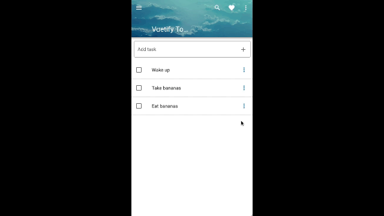

# Vuetify Todo
This project is based on ["Make Apps with Danny" Vuetify demonstration](https://www.youtube.com/watch?v=CjXgoYo86yY).

## Changes in this Branch

The original demonstration finishes with several challenges that are addressed in the author's course. I took it as a personal challenge and tried to implement some of them.

This branch features a confirm deletion dialog.

PS: You should notice that the code is a terrible mess at this point. Decoupling code into components is absolutely necessary. However, I will manage this later.

Firstly, I adde a `v-dialog` with a `v-card` wrapped into it, and their necessary data elements.

Then, I reused the existent `deleteTask()` method.