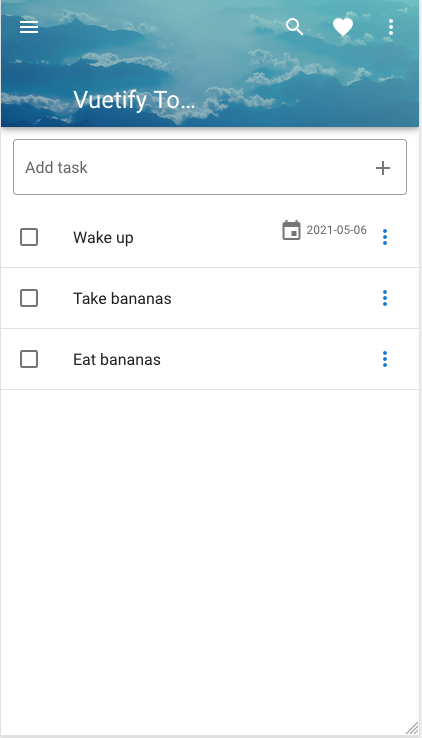

# Vuetify Todo
This project is based on ["Make Apps with Danny" Vuetify demonstration](https://www.youtube.com/watch?v=CjXgoYo86yY).

## Changes in this Branch

The original demonstration finishes with several challenges that are addressed in the author's course. I took it as a personal challenge and tried to implement some of them.

This branch features a calendar, that adds a due date for the task.

PS: You should notice that the code is a terrible mess at this point. Decoupling code into components is absolutely necessary. However, I will manage this later.



Firstly, inside the `v-list-item-action` that defines the `v-menu`, I added a flex `div`.  This enables adding both the `v-list-item-action-text` and the `v-menu`, side by side.

```
<div class="d-flex justify-end">
                  
  <v-list-item-action-text v-if="task.due">
    <v-icon>mdi-calendar</v-icon>
    {{ task.due }}
  </v-list-item-action-text>

  <v-menu bottom left>
  ...
```

Next, I added a `v-dialog`, `v-card` and `v-date-picker`. Each one wrapped into another. 

Then, I added two new data objects: `showCalendar` & `datePicker`, in addition to the `saveDate()` method.