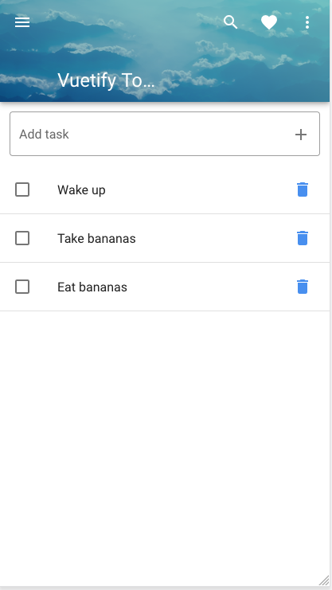
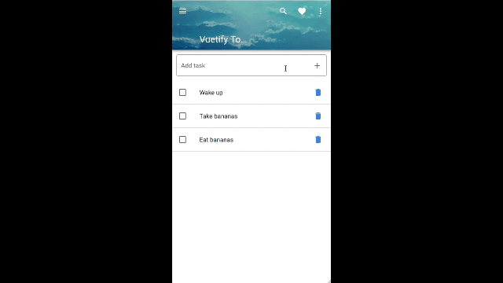
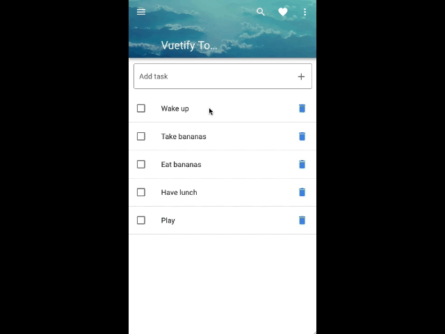
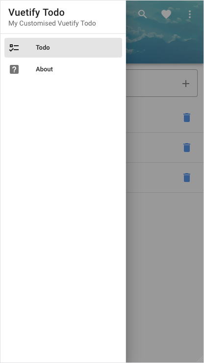
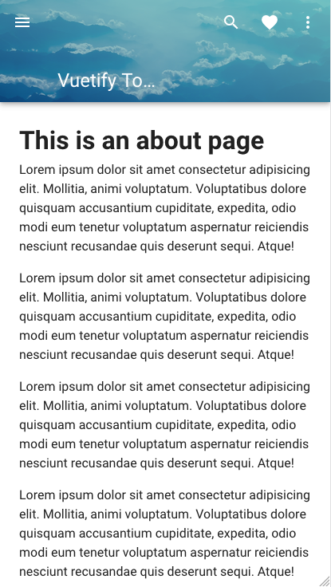

# Vuetify Todo
This project is based on ["Make Apps with Danny" Vuetify demonstration](https://www.youtube.com/watch?v=CjXgoYo86yY).

## Project Overview

This is a todo app that enables creating and deleting todos, as well as marking out tasks as completed. Vuetify is the component library used to styling the app. Although this is a Web app, the style is more appealing from a mobile perspective - as you may notice. 

Originally, this is a single component application although I am planning to modularise it at some point in the future.

Data is managed as a single array inside the app.

### Main Screen



The main page consists of an app bar at the top, an input box for adding tasks, just below the app bar, and a list of current tasks. 

Each task may be marked out as completed by clicking on the checkbox, or deleted, by clicking on the trash bin icon.

In addition, the side menu enables navigation among other pages. Apart from the hamburger icon, the other icons in the app bar are deactivated.

### Adding New TODO



Adding a new TODO is as simple as typing the TODO in the input text and hitting `Enter`. In the code, this is achieved by `@keyup.enter="addTask"`. 

### Checking Task as Completed



The `v-checkbox` component is added as a `v-list-item-action` child. It is bound to the `task.done` method, which changes the current task state. 

### Removing Existing TODO

One can remove a TODO from the list by clicking on the trash bin. The `v-list-item` component has the `v-list-item-action` child component that enables adding buttons to an item. 

In this case, because of the checkbox, we have to prevent the checkbox activation by adding `@click.stop` when binding the button (`v-btn`) to the delete event. The delete method just remove the entry from the array by using the task id.

### App Bar

The `v-app-bar` component creates the app bar. It has several properties that enable the component customisation. The app bar image is courtesy of David Mark, from [Pixabay](https://pixabay.com).

### Side Menu



The side menu is a `v-navigation-drawer` component. A `v-list-item` creates side menu items. Vuetify integrates with _Vue router_  out of the box. A `v-list-item` has the property `to`, which enables setting the router target.

### About Page



Nothing special here. It is just a _Lorem ipsum_ page to demonstrate the Vue router in action. The `<v-main>` tag wraps the traditional `<router-view></router-view>`, where the pages are loaded.

## Views and Components Overview


## Project setup
```
yarn install
```

```
yarn serve
```